# The Uncertainty Reduction Framework for System Reverse Engineering

## Executive Summary

This framework presents a **domain-agnostic** methodology for reverse engineering any system—whether physical, software, organizational, biological, economic, or social. Rather than treating reverse engineering as mechanical deconstruction, it models the process as **scientific inquiry**: a systematic journey from total uncertainty (black box) to sufficient clarity (predictive model) through hypothesis-driven investigation.

**Core Principle:** Reverse engineering is the systematic reduction of epistemic uncertainty through targeted probes, rigorous measurement, and iterative model refinement.

**Applicable Domains:**
- Software systems (binaries, protocols, APIs)
- Hardware systems (circuits, mechanical devices, embedded systems)
- Organizational systems (business processes, decision-making structures)
- Biological systems (cellular pathways, ecological networks)
- Economic systems (market mechanisms, trading strategies)
- Social systems (influence networks, information propagation)
- Physical systems (unknown mechanisms, black-box devices)

---

## Foundational Concepts

### The System Identification Paradigm

System identification is the process of building mathematical models of dynamic systems from measured input-output data. This framework adapts three fundamental modeling approaches:

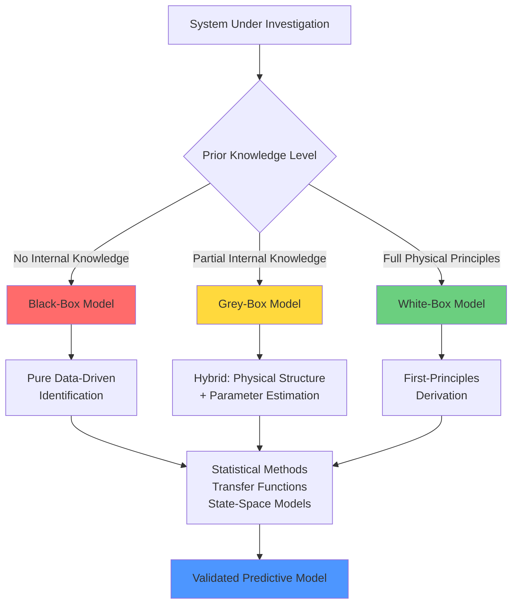
```mermaid
graph TD
    A[System Under Investigation] --> B{Prior Knowledge Level}
    B -->|No Internal Knowledge| C[Black-Box Model]
    B -->|Partial Internal Knowledge| D[Grey-Box Model]
    B -->|Full Physical Principles| E[White-Box Model]
    
    C --> F[Pure Data-Driven<br/>Identification]
    D --> G[Hybrid: Physical Structure<br/>+ Parameter Estimation]
    E --> H[First-Principles<br/>Derivation]
    
    F --> I[Statistical Methods<br/>Transfer Functions<br/>State-Space Models]
    G --> I
    H --> I
    
    I --> J[Validated Predictive Model]
    
    style C fill:#ff6b6b
    style D fill:#ffd93d
    style E fill:#6bcf7f
    style J fill:#4d96ff
```

**Model Types:**
1. **Black-Box Models**: No assumptions about internal structure; pure input-output mapping
2. **Grey-Box Models**: Combine known physical structure with unknown parameters
3. **White-Box Models**: Full derivation from first principles

### Information-Theoretic Foundations

The reverse engineering process is fundamentally about **uncertainty reduction**, quantified using Shannon entropy:

**Key Information Measures:**

1. **Entropy (H)** - Uncertainty in a system state:
   $$H(X) = -\sum_{i} P(x_i) \log_2 P(x_i)$$

2. **Mutual Information (I)** - Information shared between input and output:
   $$I(X;Y) = H(Y) - H(Y|X)$$
   
3. **Conditional Entropy** - Remaining uncertainty after observation:
   $$H(X|Y) = H(X,Y) - H(Y)$$

```mermaid
graph LR
    subgraph "Information Flow"
    A[System Input X<br/>Entropy: H(X)] -->|Mutual Info: I(X;Y)| B[System Output Y<br/>Entropy: H(Y)]
    end
    
    C[Noise/Uncertainty<br/>H(Y|X)] -.->|Adds| B
    D[Measurement<br/>Reduces H(X|Y)] -.->|Constrains| A
    
    style A fill:#95e1d3
    style B fill:#f38181
    style C fill:#aa96da
    style D fill:#fcbad3
```

**Practical Application:**
- High entropy → High uncertainty → Need more measurements
- Low mutual information → Weak input-output coupling → Need different probe signals
- Decreasing conditional entropy → Learning is occurring

### The Observability-Controllability Duality

From control theory, two fundamental properties determine what can be learned about a system:

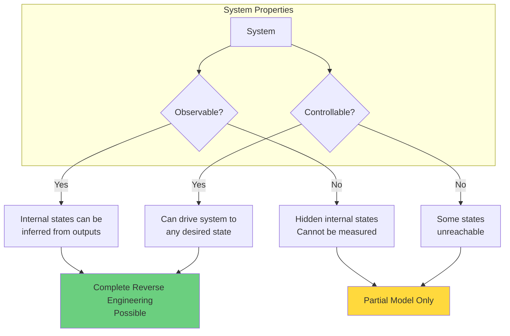
```mermaid
graph TB
    subgraph "System Properties"
    A[System] --> B{Observable?}
    A --> C{Controllable?}
    end
    
    B -->|Yes| D[Internal states can be<br/>inferred from outputs]
    B -->|No| E[Hidden internal states<br/>Cannot be measured]
    
    C -->|Yes| F[Can drive system to<br/>any desired state]
    C -->|No| G[Some states<br/>unreachable]
    
    D --> H[Complete Reverse Engineering<br/>Possible]
    E --> I[Partial Model Only]
    F --> H
    G --> I
    
    style H fill:#6bcf7f
    style I fill:#ffd93d
```

**Observability Test** (Kalman Criterion):
For a linear system with state matrix A and output matrix C, the system is observable if the observability matrix has full rank:
$$\mathcal{O} = \begin{bmatrix} C \\ CA \\ CA^2 \\ \vdots \\ CA^{n-1} \end{bmatrix}$$

**Practical Implications:**
- **Unobservable modes**: Internal dynamics that cannot be seen from outputs (e.g., internal buffering, hidden state machines)
- **Uncontrollable modes**: States that cannot be influenced by inputs (e.g., initialization parameters, fixed hardware constants)

---

## Phase 1: Frame Definition & Epistemic Baseline

**Cognitive Role:** The Humble Cartographer  
**Objective:** Map the boundaries of your ignorance  
**Duration:** 5-20% of total effort

### 1.1 Objective Distillation

Transform vague goals into precise epistemic questions.

**Mental Tool: The Question Pyramid**

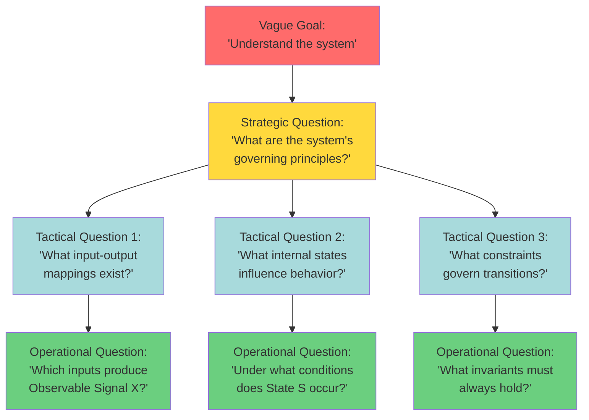
```mermaid
graph TD
    A[Vague Goal:<br/>'Understand the system'] --> B[Strategic Question:<br/>'What are the system's<br/>governing principles?']
    
    B --> C1[Tactical Question 1:<br/>'What input-output<br/>mappings exist?']
    B --> C2[Tactical Question 2:<br/>'What internal states<br/>influence behavior?']
    B --> C3[Tactical Question 3:<br/>'What constraints<br/>govern transitions?']
    
    C1 --> D1[Operational Question:<br/>'Which inputs produce<br/>Observable Signal X?']
    C2 --> D2[Operational Question:<br/>'Under what conditions<br/>does State S occur?']
    C3 --> D3[Operational Question:<br/>'What invariants must<br/>always hold?']
    
    style A fill:#ff6b6b
    style B fill:#ffd93d
    style C1 fill:#a8dadc
    style C2 fill:#a8dadc
    style C3 fill:#a8dadc
    style D1 fill:#6bcf7f
    style D2 fill:#6bcf7f
    style D3 fill:#6bcf7f
```

**Examples Across Domains:**

| Domain | Vague Goal | Precise Question |
|--------|-----------|------------------|
| Software | "Reverse this binary" | "What is the exact licensing validation algorithm?" |
| Hardware | "Figure out this circuit" | "What transfer function relates input voltage to output current?" |
| Business | "Understand competitor strategy" | "What decision rule determines their pricing in market condition X?" |
| Biology | "Understand this pathway" | "What feedback mechanism regulates protein P concentration?" |

### 1.2 Known-Unknown Inventory (Epistemic Mapping)

**Mental Tool: The Rumsfeld Matrix Extended**

```mermaid
quadrantChart
    title Epistemic State Space
    x-axis Low Certainty --> High Certainty
    y-axis Low Awareness --> High Awareness
    quadrant-1 Known Knowns (Verify)
    quadrant-2 Known Unknowns (Investigate)
    quadrant-3 Unknown Knowns (Challenge Assumptions)
    quadrant-4 Unknown Unknowns (Explore)
    Known Facts: [0.8, 0.8]
    Explicit Questions: [0.3, 0.8]
    Implicit Assumptions: [0.7, 0.3]
    Black Holes: [0.2, 0.2]
```

**Formal Process:**

1. **Known Knowns (Verified Facts):**
   - System type/category
   - Observable inputs/outputs
   - Documented specifications
   - *Test:* Can you prove this with independent measurement?

2. **Known Unknowns (Explicit Gaps):**
   - Missing parameters
   - Unobserved internal states
   - Unexplored input regions
   - *Action:* These become your investigation targets

3. **Unknown Knowns (Dangerous Assumptions):**
   - "Obviously it uses TCP/IP"
   - "Surely they followed best practices"
   - "This must be a standard implementation"
   - *Priority:* Challenge these FIRST

4. **Unknown Unknowns (The Void):**
   - Unrecognized system components
   - Unanticipated interactions
   - Hidden complexity
   - *Strategy:* Systematic boundary probing reveals these

### 1.3 Define "Sufficient Clarity"

**Mental Tool: The Fidelity Ladder**

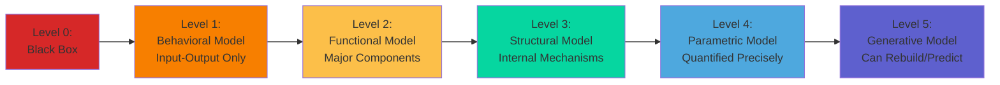
```mermaid
graph LR
    A[Level 0:<br/>Black Box] --> B[Level 1:<br/>Behavioral Model<br/>Input-Output Only]
    B --> C[Level 2:<br/>Functional Model<br/>Major Components]
    C --> D[Level 3:<br/>Structural Model<br/>Internal Mechanisms]
    D --> E[Level 4:<br/>Parametric Model<br/>Quantified Precisely]
    E --> F[Level 5:<br/>Generative Model<br/>Can Rebuild/Predict]
    
    style A fill:#d62828
    style B fill:#f77f00
    style C fill:#fcbf49
    style D fill:#06d6a0
    style E fill:#4ea8de
    style F fill:#5e60ce
```

**Define Your Target Fidelity:**
- **Behavioral (Level 1-2):** Sufficient for exploitation, attack, or usage
- **Structural (Level 3-4):** Required for modification, patching, or optimization
- **Generative (Level 5):** Necessary for complete replication or formal verification

**Example Criteria:**
```
Target: Level 3 (Structural Model)
Success Metrics:
✓ Can predict output for 95% of input cases
✓ Can identify the 3 main subsystems and their interfaces
✓ Can explain the purpose of major data structures
✗ Don't need: Exact algorithmic implementation
✗ Don't need: Bit-level protocol details
```

### 1.4 Cognitive Traps to Avoid

**Anti-Pattern Detection:**

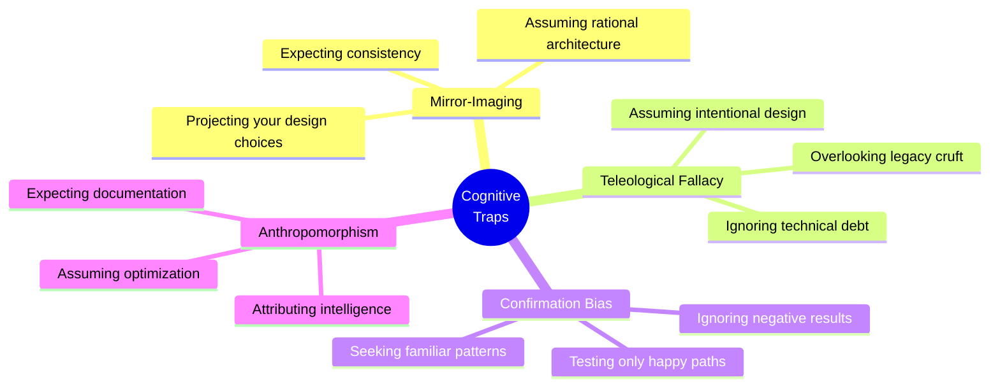
```mermaid
mindmap
  root((Cognitive<br/>Traps))
    Mirror-Imaging
      Projecting your design choices
      Assuming rational architecture
      Expecting consistency
    Teleological Fallacy
      Assuming intentional design
      Overlooking legacy cruft
      Ignoring technical debt
    Confirmation Bias
      Testing only happy paths
      Ignoring negative results
      Seeking familiar patterns
    Anthropomorphism
      Attributing intelligence
      Assuming optimization
      Expecting documentation
```

**Counter-Measures:**
1. **Adversarial Testing:** Deliberately try to prove yourself wrong
2. **Null Hypothesis:** Assume chaos until order is proven
3. **Multiple Working Hypotheses:** Maintain 3+ competing models simultaneously

---

## Phase 2: System Boundary Mapping & Behavioral Cartography

**Cognitive Role:** The Border Guard  
**Objective:** Characterize the system's behavioral surface without internal knowledge  
**Duration:** 25-35% of total effort

### 2.1 Interface Discovery & Enumeration

**Mental Tool: The I/O Surface Mesh**

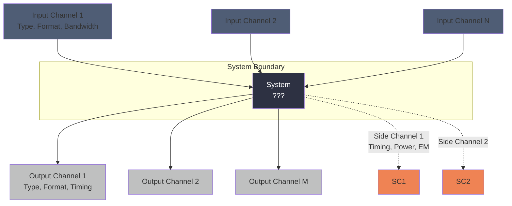
```mermaid
graph TB
    subgraph "System Boundary"
    S[System<br/>???]
    end
    
    I1[Input Channel 1<br/>Type, Format, Bandwidth] --> S
    I2[Input Channel 2] --> S
    I3[Input Channel N] --> S
    
    S --> O1[Output Channel 1<br/>Type, Format, Timing]
    S --> O2[Output Channel 2]
    S --> O3[Output Channel M]
    
    S -.->|Side Channel 1<br/>Timing, Power, EM| SC1
    S -.->|Side Channel 2| SC2
    
    style S fill:#2d3142,color:#fff
    style I1 fill:#4f5d75
    style I2 fill:#4f5d75
    style I3 fill:#4f5d75
    style O1 fill:#bfc0c0
    style O2 fill:#bfc0c0
    style O3 fill:#bfc0c0
    style SC1 fill:#ef8354
    style SC2 fill:#ef8354
```

**Systematic Enumeration:**

| Interface Type | Detection Method | Characteristics to Measure |
|---------------|------------------|---------------------------|
| **Explicit Inputs** | Documentation, inspection | Data type, format, valid ranges, rate limits |
| **Implicit Inputs** | Perturbation testing | Environment variables, system time, random seeds |
| **Direct Outputs** | Observation | Signal type, encoding, update frequency |
| **Indirect Outputs** | Monitoring | State changes, side effects, resource usage |
| **Side Channels** | Instrumentation | Timing variations, power consumption, EM radiation |

### 2.2 Transfer Function Estimation

The transfer function H(s) characterizes the system's input-output relationship in the frequency domain.

**For Linear Time-Invariant (LTI) Systems:**

$$H(f) = \frac{S_{yx}(f)}{S_{xx}(f)}$$

Where:
- $S_{yx}(f)$ = Cross-spectral density between input x and output y
- $S_{xx}(f)$ = Power spectral density of input x

**Estimation Procedure:**

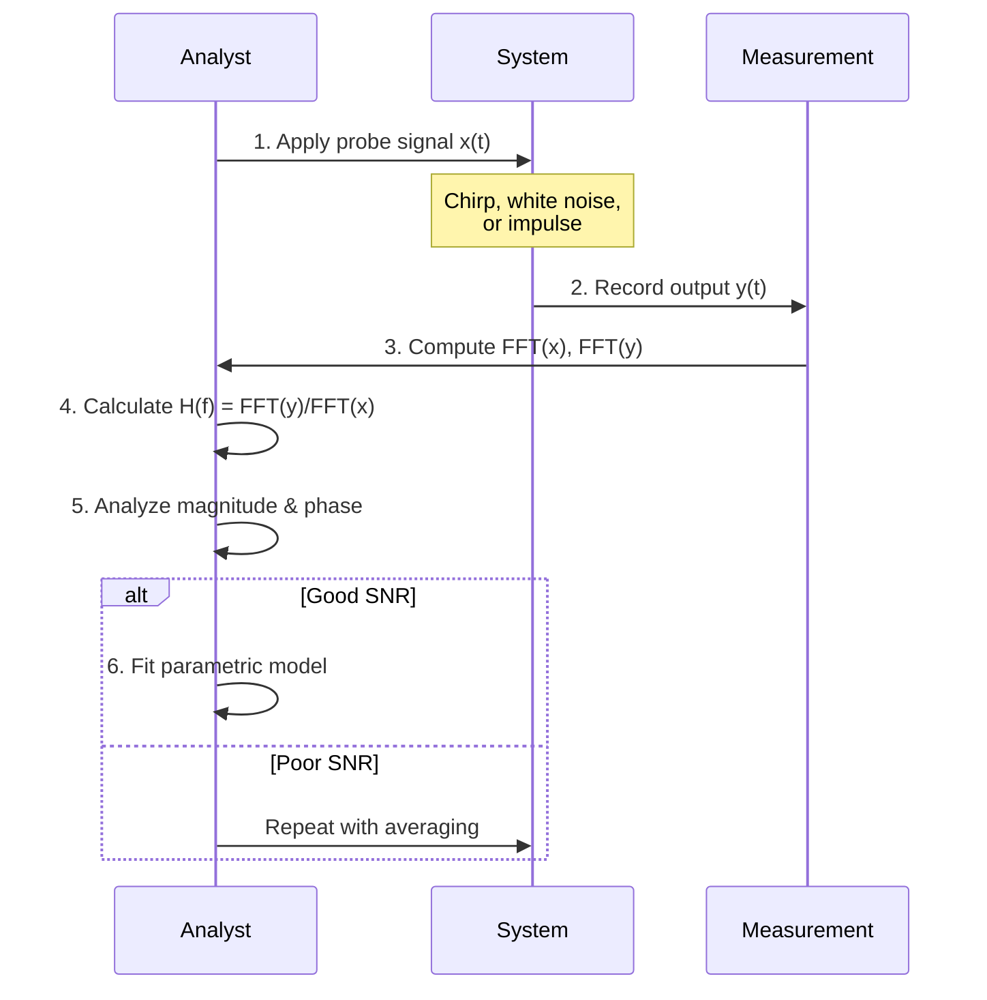
```mermaid
sequenceDiagram
    participant Analyst
    participant System
    participant Measurement
    
    Analyst->>System: 1. Apply probe signal x(t)
    Note over System: Chirp, white noise,<br/>or impulse
    System->>Measurement: 2. Record output y(t)
    Measurement->>Analyst: 3. Compute FFT(x), FFT(y)
    Analyst->>Analyst: 4. Calculate H(f) = FFT(y)/FFT(x)
    Analyst->>Analyst: 5. Analyze magnitude & phase
    
    alt Good SNR
        Analyst->>Analyst: 6. Fit parametric model
    else Poor SNR
        Analyst->>System: Repeat with averaging
    end
```

**Probe Signal Selection:**

1. **Impulse (δ-function):**
   - Pro: Theoretically ideal—covers all frequencies
   - Con: Requires infinite bandwidth, poor SNR
   - Use when: System has fast dynamics, single-shot testing

2. **White Noise:**
   - Pro: Excites all frequencies simultaneously
   - Con: Requires averaging over many trials
   - Use when: Can run extended tests, system is stationary

3. **Chirp/Sweep:**
   - Pro: Good SNR, controlled spectral content
   - Con: Assumes time-invariance during sweep
   - Use when: Need to cover specific frequency range

4. **Pseudo-Random Binary Sequence (PRBS):**
   - Pro: Approximates white noise with deterministic signal
   - Con: Requires careful design for period/bandwidth
   - Use when: Digital systems, need repeatability

### 2.3 Stimulus-Response Mapping

**Mental Tool: The Perturbation Matrix**

Create a systematic mapping of all input-output relationships:

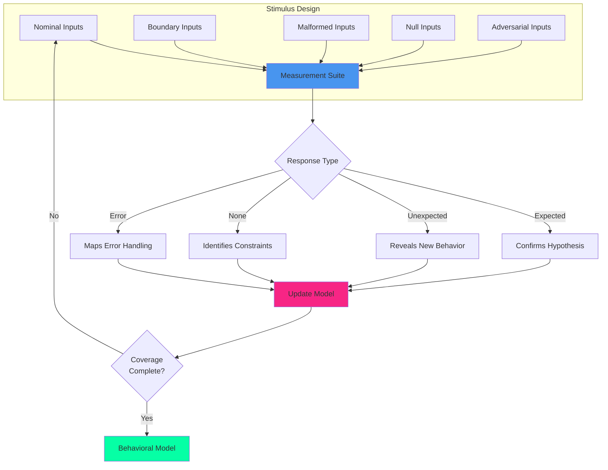
```mermaid
graph TD
    subgraph "Stimulus Design"
    A[Nominal Inputs] --> M[Measurement Suite]
    B[Boundary Inputs] --> M
    C[Malformed Inputs] --> M
    D[Null Inputs] --> M
    E[Adversarial Inputs] --> M
    end
    
    M --> F{Response Type}
    
    F -->|Expected| G[Confirms Hypothesis]
    F -->|Unexpected| H[Reveals New Behavior]
    F -->|None| I[Identifies Constraints]
    F -->|Error| J[Maps Error Handling]
    
    G --> K[Update Model]
    H --> K
    I --> K
    J --> K
    
    K --> L{Coverage<br/>Complete?}
    L -->|No| A
    L -->|Yes| N[Behavioral Model]
    
    style M fill:#4895ef
    style K fill:#f72585
    style N fill:#06ffa5
```

**Measurement Dimensions:**

For each stimulus, record:

1. **Temporal Response:**
   - Latency: Time to first output
   - Duration: Time to complete response
   - Jitter: Variability in timing
   
2. **Quantitative Response:**
   - Output magnitude
   - Output rate/frequency
   - Resource consumption (CPU, memory, power)

3. **Qualitative Response:**
   - Output type/format
   - Error codes/messages
   - State transitions observed

4. **Statistical Properties:**
   - Repeatability (σ²)
   - Correlation with input
   - Spectral characteristics

### 2.4 Edge Case Exploration

**Mental Tool: The Boundary Walker**

Systematically explore the limits of system behavior:

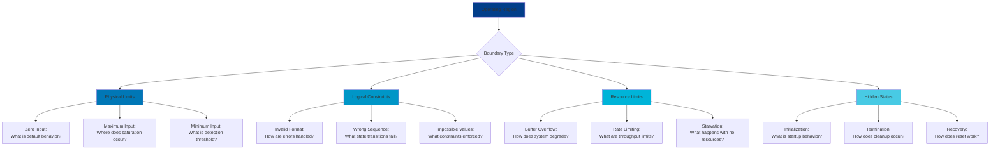
```mermaid
graph TB
    A[Operating Region] --> B{Boundary Type}
    
    B --> C[Physical Limits]
    B --> D[Logical Constraints]
    B --> E[Resource Limits]
    B --> F[Hidden States]
    
    C --> C1[Zero Input:<br/>What is default behavior?]
    C --> C2[Maximum Input:<br/>Where does saturation occur?]
    C --> C3[Minimum Input:<br/>What is detection threshold?]
    
    D --> D1[Invalid Format:<br/>How are errors handled?]
    D --> D2[Wrong Sequence:<br/>What state transitions fail?]
    D --> D3[Impossible Values:<br/>What constraints enforced?]
    
    E --> E1[Buffer Overflow:<br/>How does system degrade?]
    E --> E2[Rate Limiting:<br/>What are throughput limits?]
    E --> E3[Starvation:<br/>What happens with no resources?]
    
    F --> F1[Initialization:<br/>What is startup behavior?]
    F --> F2[Termination:<br/>How does cleanup occur?]
    F --> F3[Recovery:<br/>How does reset work?]
    
    style A fill:#023e8a
    style C fill:#0077b6
    style D fill:#0096c7
    style E fill:#00b4d8
    style F fill:#48cae4
```

**Systematic Boundary Testing:**

```python
# Pseudocode for boundary exploration
def explore_boundaries(system):
    results = {}
    
    # Test zero/minimal inputs
    results['zero'] = system.respond(input=0)
    results['empty'] = system.respond(input='')
    
    # Test maximal inputs (find saturation)
    for magnitude in [10, 100, 1000, 10000, ...]:
        response = system.respond(input=magnitude)
        if response.saturated():
            results['max'] = magnitude
            break
    
    # Test malformed inputs
    for corrupt_input in generate_mutations(valid_input):
        try:
            response = system.respond(corrupt_input)
            results['robust'].append((corrupt_input, response))
        except Exception as e:
            results['failures'].append((corrupt_input, e))
    
    # Test timing edge cases
    results['concurrent'] = system.respond_multiple(inputs_simultaneous)
    results['sequential'] = system.respond_multiple(inputs_ordered)
    
    return results
```

### 2.5 Behavioral Hypothesis Generation

**From observations, generate testable hypotheses about system dynamics:**

**Pattern Recognition Framework:**

1. **Recognize System Archetypes:**

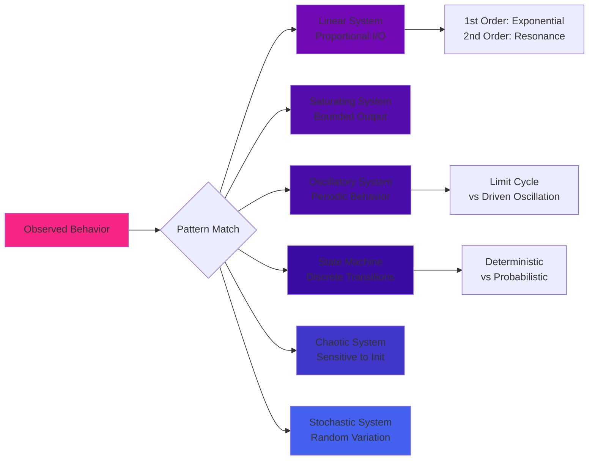
```mermaid
graph LR
    A[Observed Behavior] --> B{Pattern Match}
    
    B --> C[Linear System<br/>Proportional I/O]
    B --> D[Saturating System<br/>Bounded Output]
    B --> E[Oscillatory System<br/>Periodic Behavior]
    B --> F[State Machine<br/>Discrete Transitions]
    B --> G[Chaotic System<br/>Sensitive to Init]
    B --> H[Stochastic System<br/>Random Variation]
    
    C --> I[1st Order: Exponential<br/>2nd Order: Resonance]
    E --> J[Limit Cycle<br/>vs Driven Oscillation]
    F --> K[Deterministic<br/>vs Probabilistic]
    
    style A fill:#f72585
    style C fill:#7209b7
    style D fill:#560bad
    style E fill:#480ca8
    style F fill:#3a0ca3
    style G fill:#3f37c9
    style H fill:#4361ee
```

2. **Formulate Competing Hypotheses:**

Never settle on a single explanation. Maintain multiple working hypotheses:

| Hypothesis | Evidence For | Evidence Against | Test to Discriminate |
|-----------|-------------|------------------|---------------------|
| H1: Pure time-delay system | Constant latency observed | - | Vary input bandwidth, check if delay changes |
| H2: Low-pass filter + delay | Smooth frequency rolloff | - | Measure phase vs frequency |
| H3: State machine with timer | Discrete behavioral changes | Timing variations | Probe during state transitions |

**Cognitive Checkpoint:**
- Have you tested inputs you expect to **fail**?
- Have you explored the system's behavior at its **boundaries**?
- Can you predict the response to an input you haven't tried yet?

---

## Phase 3: Causal Chain Analysis & Hypothesis-Driven Dissection

**Cognitive Role:** The Skeptical Scientist  
**Objective:** Build and validate cause-effect models linking inputs to outputs  
**Duration:** 30-40% of total effort

### 3.1 Static Structural Analysis

**Mental Tool: The Archaeological Dig**

Examine the system's "frozen" structure for clues about function:

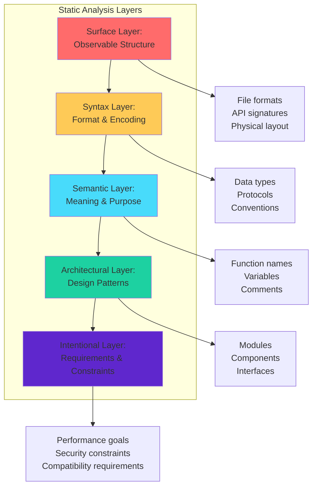
```mermaid
graph TD
    subgraph "Static Analysis Layers"
    A[Surface Layer:<br/>Observable Structure] --> B[Syntax Layer:<br/>Format & Encoding]
    B --> C[Semantic Layer:<br/>Meaning & Purpose]
    C --> D[Architectural Layer:<br/>Design Patterns]
    D --> E[Intentional Layer:<br/>Requirements & Constraints]
    end
    
    A --> A1[File formats<br/>API signatures<br/>Physical layout]
    B --> B1[Data types<br/>Protocols<br/>Conventions]
    C --> C1[Function names<br/>Variables<br/>Comments]
    D --> D1[Modules<br/>Components<br/>Interfaces]
    E --> E1[Performance goals<br/>Security constraints<br/>Compatibility requirements]
    
    style A fill:#ff6b6b
    style B fill:#feca57
    style C fill:#48dbfb
    style D fill:#1dd1a1
    style E fill:#5f27cd
```

**Information Extraction Methods:**

1. **Structural Pattern Recognition:**
   - Identify repeated structures (loops, recursion, feedback)
   - Recognize standard components (filters, buffers, controllers)
   - Spot anomalies (vestigial code, debug leftovers)

2. **Information-Theoretic Analysis:**
   
   **Entropy Analysis:**
   - High-entropy regions → Encrypted/compressed data or random numbers
   - Low-entropy regions → Repeated patterns or constants
   - Structured entropy → Formatted data or code

   $$H(X) = -\sum_{i=1}^{n} p(x_i) \log_2 p(x_i)$$

3. **Dependency Graph Construction:**

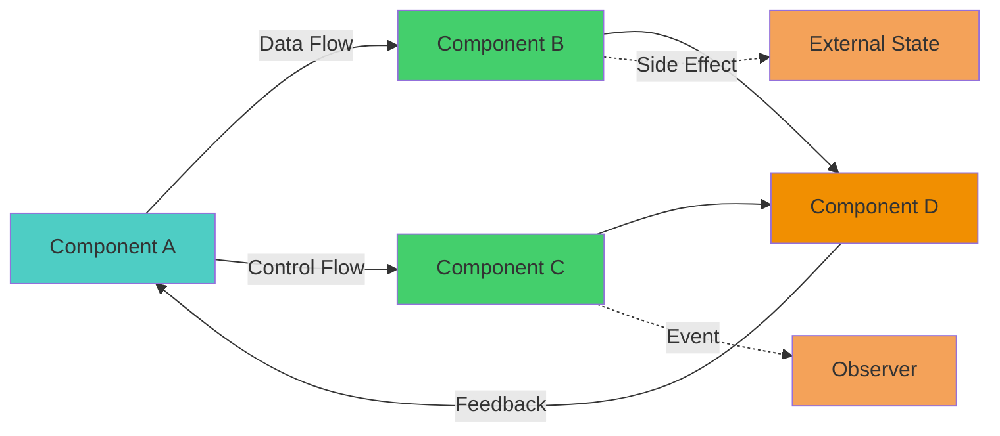
```mermaid
graph LR
    A[Component A] -->|Data Flow| B[Component B]
    A -->|Control Flow| C[Component C]
    B --> D[Component D]
    C --> D
    D -->|Feedback| A
    
    B -.->|Side Effect| E[External State]
    C -.->|Event| F[Observer]
    
    style A fill:#4ecdc4
    style B fill:#44cf6c
    style C fill:#44cf6c
    style D fill:#f18f01
    style E fill:#f4a259
    style F fill:#f4a259
```

### 3.2 Dynamic Causal Chain Validation

**The Scientific Method Applied:**

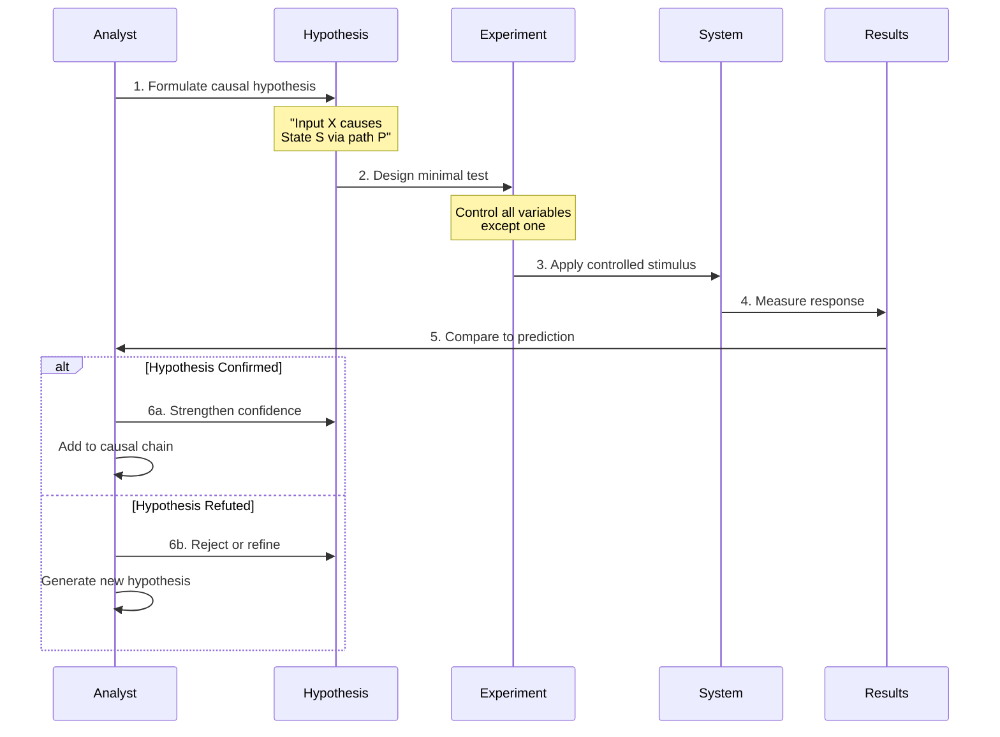
```mermaid
sequenceDiagram
    participant Analyst
    participant Hypothesis
    participant Experiment
    participant System
    participant Results
    
    Analyst->>Hypothesis: 1. Formulate causal hypothesis
    Note over Hypothesis: "Input X causes<br/>State S via path P"
    
    Hypothesis->>Experiment: 2. Design minimal test
    Note over Experiment: Control all variables<br/>except one
    
    Experiment->>System: 3. Apply controlled stimulus
    System->>Results: 4. Measure response
    
    Results->>Analyst: 5. Compare to prediction
    
    alt Hypothesis Confirmed
        Analyst->>Hypothesis: 6a. Strengthen confidence
        Analyst->>Analyst: Add to causal chain
    else Hypothesis Refuted
        Analyst->>Hypothesis: 6b. Reject or refine
        Analyst->>Analyst: Generate new hypothesis
    end
```

**Experimental Design Principles:**

1. **Isolation:** Change only ONE variable per experiment
2. **Control:** Establish baseline behavior first
3. **Repeatability:** Verify results across multiple trials
4. **Falsifiability:** Design tests that could prove you wrong

**Mental Tool: The Tracer Technique**

Inject unique, easily identifiable markers and trace their propagation:


```mermaid
graph LR
    A[Inject Unique<br/>Marker Signal] --> B{System<br/>Processing}
    
    B --> C[Checkpoint 1:<br/>Did marker appear?]
    C -->|Yes| D[Checkpoint 2:<br/>Was it modified?]
    C -->|No| X[Path not taken]
    
    D -->|Yes| E[Checkpoint 3:<br/>How was it transformed?]
    D -->|No| Y[Pass-through component]
    
    E --> F[Build transformation<br/>model]
    
    style A fill:#06ffa5
    style B fill:#2d3142
    style C fill:#4f5d75
    style D fill:#4f5d75
    style E fill:#4f5d75
    style F fill:#f72585
    style X fill:#ef476f
    style Y fill:#ffd93d
```

**Example Tracer Values:**
- Unique strings: `"TRACE_A7B3_INPUT"`, `"PROBE_9F2E_OUTPUT"`
- Magic numbers: `0xDEADBEEF`, `0xCAFEBABE`, `0x8BADF00D`
- Bit patterns: Alternating `10101010` or unique sequences
- Prime numbers: Easy to identify in arithmetic operations

### 3.3 Causal Model Construction

**Mental Tool: The Directed Acyclic Graph (DAG) of Causality**

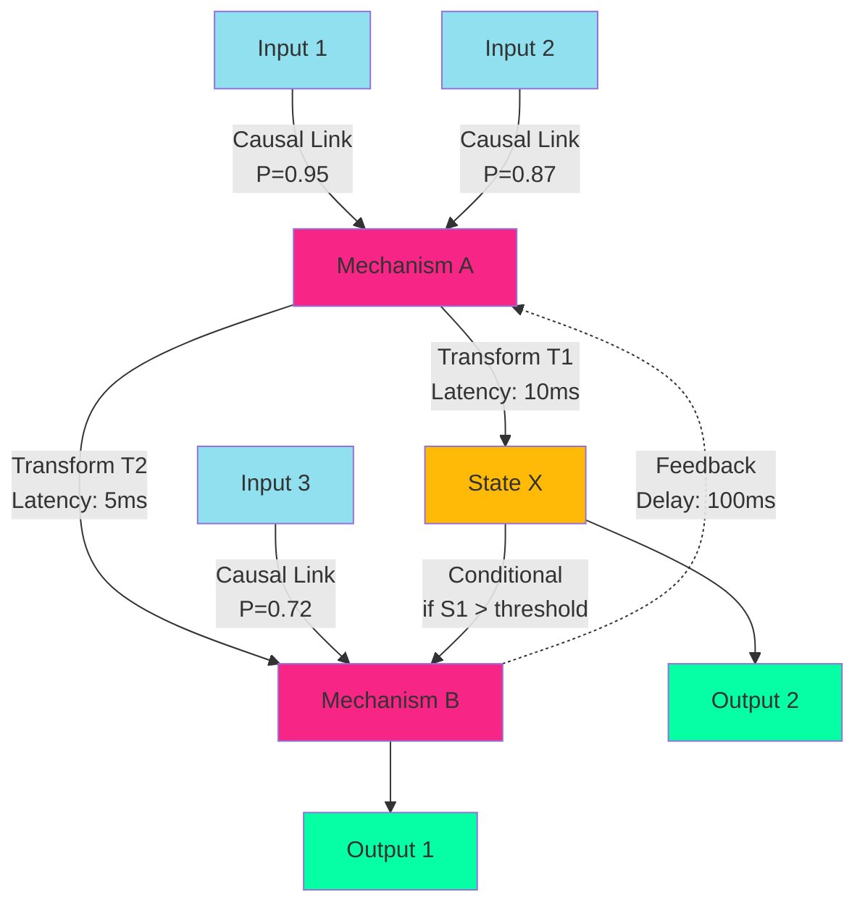
```mermaid
graph TD
    I1[Input 1] -->|Causal Link<br/>P=0.95| M1[Mechanism A]
    I2[Input 2] -->|Causal Link<br/>P=0.87| M1
    
    M1 -->|Transform T1<br/>Latency: 10ms| S1[State X]
    M1 -->|Transform T2<br/>Latency: 5ms| M2[Mechanism B]
    
    I3[Input 3] -->|Causal Link<br/>P=0.72| M2
    S1 -->|Conditional<br/>if S1 > threshold| M2
    
    M2 --> O1[Output 1]
    S1 --> O2[Output 2]
    
    M2 -.->|Feedback<br/>Delay: 100ms| M1
    
    style I1 fill:#90e0ef
    style I2 fill:#90e0ef
    style I3 fill:#90e0ef
    style M1 fill:#f72585
    style M2 fill:#f72585
    style S1 fill:#ffba08
    style O1 fill:#06ffa5
    style O2 fill:#06ffa5
```

**Annotate Each Edge With:**
- **Confidence Level:** P(causal relationship exists)
- **Transformation:** Mathematical or logical operation
- **Latency:** Time delay from cause to effect
- **Conditions:** When does this link activate?

**Hypothesis Validation Score:**

For each causal link hypothesis:

$$\text{Confidence} = \frac{\text{Successes}}{\text{Total Tests}} \times (1 - \frac{\text{Variance}}{\text{Mean Response}})$$

### 3.4 Differential Analysis

**Compare system behavior under controlled perturbations:**

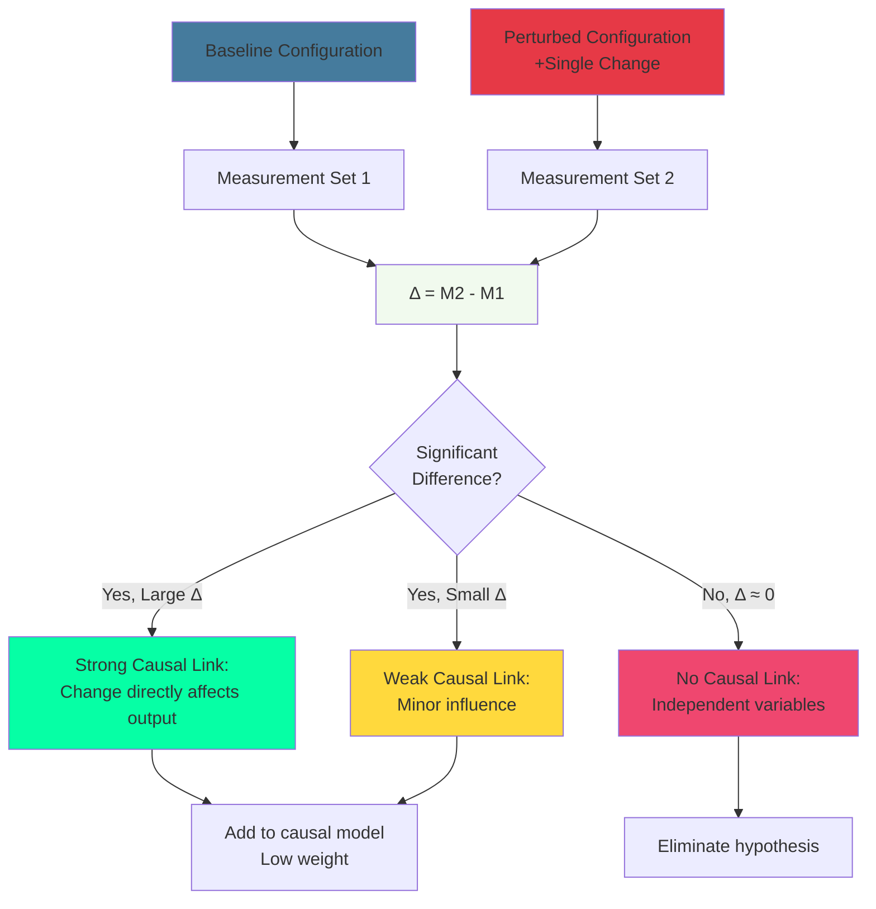
```mermaid
graph TB
    A[Baseline Configuration] --> B[Measurement Set 1]
    C[Perturbed Configuration<br/>+Single Change] --> D[Measurement Set 2]
    
    B --> E[Δ = M2 - M1]
    D --> E
    
    E --> F{Significant<br/>Difference?}
    
    F -->|Yes, Large Δ| G[Strong Causal Link:<br/>Change directly affects output]
    F -->|Yes, Small Δ| H[Weak Causal Link:<br/>Minor influence]
    F -->|No, Δ ≈ 0| I[No Causal Link:<br/>Independent variables]
    
    G --> J[Add to causal model<br/>High weight]
    H --> J[Add to causal model<br/>Low weight]
    I --> K[Eliminate hypothesis]
    
    style A fill:#457b9d
    style C fill:#e63946
    style E fill:#f1faee
    style G fill:#06ffa5
    style H fill:#ffd93d
    style I fill:#ef476f
```

**Statistical Rigor:**

Apply appropriate statistical tests:
- **T-test:** For continuous variables, normal distributions
- **Chi-squared:** For categorical data, frequency distributions
- **ANOVA:** When comparing multiple conditions
- **Non-parametric tests:** When distributions are unknown

**Minimum Requirements:**
- n ≥ 30 samples per condition (for statistical power)
- p < 0.05 for significance (adjusting for multiple comparisons)
- Effect size > 0.5 (Cohen's d) for practical significance

### 3.5 The Observer Effect

**Warning:** Your measurements can alter the system being measured.

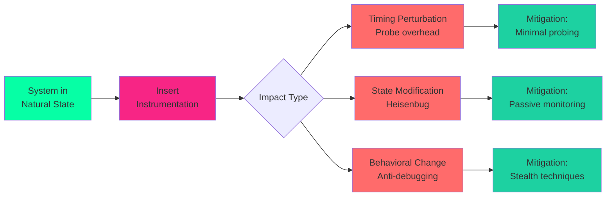
```mermaid
graph LR
    A[System in<br/>Natural State] --> B[Insert<br/>Instrumentation]
    
    B --> C{Impact Type}
    
    C --> D[Timing Perturbation<br/>Probe overhead]
    C --> E[State Modification<br/>Heisenbug]
    C --> F[Behavioral Change<br/>Anti-debugging]
    
    D --> G[Mitigation:<br/>Minimal probing]
    E --> H[Mitigation:<br/>Passive monitoring]
    F --> I[Mitigation:<br/>Stealth techniques]
    
    style A fill:#06ffa5
    style B fill:#f72585
    style D fill:#ff6b6b
    style E fill:#ff6b6b
    style F fill:#ff6b6b
    style G fill:#1dd1a1
    style H fill:#1dd1a1
    style I fill:#1dd1a1
```

**Strategies to Minimize Observer Effect:**

1. **Passive Monitoring:** Observe without interacting
   - Network taps vs. inline proxies
   - Hardware logic analyzers vs. software debuggers
   - Side-channel analysis vs. direct probing

2. **Lightweight Instrumentation:** Minimize perturbation
   - Sample instead of continuous monitoring
   - Hardware breakpoints vs. software breakpoints
   - Statistical sampling vs. exhaustive tracing

3. **Differential Observation:** Measure with/without instrumentation
   - Compare instrumented vs. uninstrumented runs
   - Quantify probe overhead
   - Correct for known artifacts

---

## Phase 4: Abstract Model Synthesis & Emergent Property Identification

**Cognitive Role:** The Abstract Architect  
**Objective:** Synthesize observations into a coherent, predictive model  
**Duration:** 20-30% of total effort

### 4.1 Model Abstraction Principles

**Occam's Razor for System Models:**

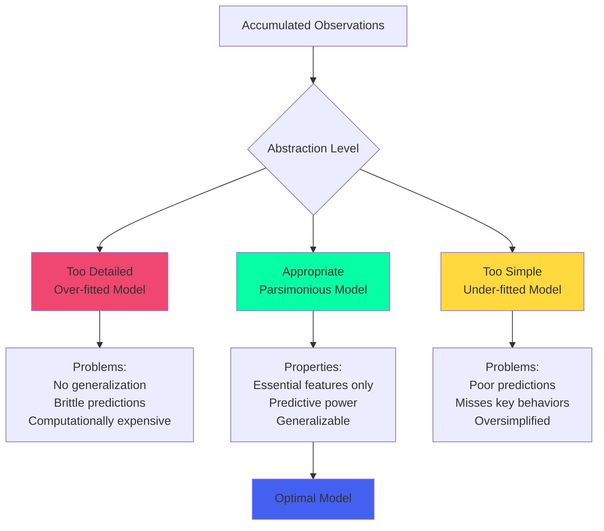
```mermaid
graph TD
    A[Accumulated Observations] --> B{Abstraction Level}
    
    B --> C[Too Detailed<br/>Over-fitted Model]
    B --> D[Appropriate<br/>Parsimonious Model]
    B --> E[Too Simple<br/>Under-fitted Model]
    
    C --> F[Problems:<br/>No generalization<br/>Brittle predictions<br/>Computationally expensive]
    
    D --> G[Properties:<br/>Essential features only<br/>Predictive power<br/>Generalizable]
    
    E --> H[Problems:<br/>Poor predictions<br/>Misses key behaviors<br/>Oversimplified]
    
    G --> I[Optimal Model]
    
    style C fill:#ef476f
    style D fill:#06ffa5
    style E fill:#ffd93d
    style I fill:#4361ee
```

**The Abstraction Ladder:**

```mermaid
graph BT
    L1[Level 1: Raw Data<br/>All observations, no compression] --> L2
    L2[Level 2: Patterns<br/>Repeated structures, regularities] --> L3
    L3[Level 3: Rules<br/>If-then logic, state transitions] --> L4
    L4[Level 4: Principles<br/>Invariants, constraints, laws] --> L5
    L5[Level 5: Theory<br/>Unified explanation, generative model]
    
    style L1 fill:#d62828
    style L2 fill:#f77f00
    style L3 fill:#fcbf49
    style L4 fill:#06d6a0
    style L5 fill:#5e60ce
```

**Climb the ladder:** Start with specific observations, generalize to patterns, extract rules, identify principles, formulate theory.

### 4.2 Identify System Invariants

**Invariants are properties that ALWAYS hold:**

```mermaid
mindmap
  root((System<br/>Invariants))
    Conservation Laws
      Mass/Energy conservation
      Charge conservation
      Information conservation
    Structural Invariants
      Fixed relationships
      Type constraints
      Cardinality limits
    Temporal Invariants
      Ordering requirements
      Causality constraints
      Time bounds
    Logical Invariants
      State predicates
      Data integrity rules
      Protocol requirements
```

**Example Invariants Across Domains:**

| Domain | Invariant Example | Mathematical Form |
|--------|------------------|-------------------|
| Software | "Session ID is always 32 bytes" | $\|SID\| = 256 \text{ bits}$ |
| Hardware | "Voltage never exceeds 5V" | $V_{out} \leq 5.0V$ |
| Network | "Sequence numbers monotonically increase" | $SEQ_{n+1} > SEQ_n$ |
| Biology | "Total enzyme concentration is constant" | $[E]_{total} = [E] + [ES] = const$ |
| Business | "Total cash flow must balance" | $\sum \text{Inflow} = \sum \text{Outflow}$ |

**Invariant Discovery Process:**

1. **Collect measurements** across many system states
2. **Identify relationships** that hold in ALL observations
3. **Formulate mathematical expression** of the relationship
4. **Test with edge cases** to verify universality
5. **Document confidence level** based on testing coverage

### 4.3 Recognize System Archetypes

**Mental Tool: The Pattern Library**

Most complex systems are compositions of well-known building blocks:

```mermaid
graph TD
    A[System] --> B{Core Metaphor}
    
    B --> C[State Machine<br/>Discrete states, transitions]
    B --> D[Pipeline<br/>Sequential stages]
    B --> E[Feedback Controller<br/>Error correction loop]
    B --> F[Producer-Consumer<br/>Buffered message passing]
    B --> G[Hierarchical System<br/>Nested subsystems]
    B --> H[Network/Graph<br/>Interconnected nodes]
    
    C --> C1[FSM, Petri Net<br/>Markov Chain]
    D --> D1[Data flow, Assembly line<br/>Signal processing chain]
    E --> E1[PID controller<br/>Homeostasis, Thermostat]
    F --> F1[Queue, Mailbox<br/>Publisher-Subscriber]
    G --> G1[Layered architecture<br/>OSI model, Organization]
    H --> H1[Social network<br/>Internet, Neural network]
    
    style B fill:#f72585
    style C fill:#7209b7
    style D fill:#560bad
    style E fill:#480ca8
    style F fill:#3a0ca3
    style G fill:#3f37c9
    style H fill:#4361ee
```

**Archetype Identification Checklist:**

| Archetype | Key Signatures | Typical Behavior |
|-----------|---------------|------------------|
| **State Machine** | Discrete modes, event-driven | Deterministic transitions, history dependence |
| **Pipeline** | Sequential processing | Fixed flow, accumulating transforms |
| **Feedback Controller** | Error signal, corrective action | Stability seeking, oscillation damping |
| **Producer-Consumer** | Async communication, buffering | Rate adaptation, queuing delays |
| **Hierarchical** | Nested abstraction layers | Top-down control, bottom-up sensing |
| **Network** | Distributed nodes, edges | Emergent behavior, spreading dynamics |

### 4.4 Identify Emergent Properties

**Emergent properties** arise from component interactions, not from individual components:

```mermaid
graph TB
    subgraph "Component Level"
    A1[Component A]
    A2[Component B]
    A3[Component C]
    end
    
    subgraph "System Level"
    B1[Emergent Property 1:<br/>Stability/Instability]
    B2[Emergent Property 2:<br/>Adaptability]
    B3[Emergent Property 3:<br/>Resilience/Fragility]
    B4[Emergent Property 4:<br/>Efficiency]
    end
    
    A1 -.-> B1
    A2 -.-> B1
    A3 -.-> B1
    
    A1 -.-> B2
    A2 -.-> B2
    
    A1 -.-> B3
    A3 -.-> B3
    
    A2 -.-> B4
    A3 -.-> B4
    
    style B1 fill:#ff006e
    style B2 fill:#8338ec
    style B3 fill:#3a86ff
    style B4 fill:#06ffa5
```

**Common Emergent Properties:**

1. **Performance:**
   - Throughput (from component bandwidths + buffering)
   - Latency (from propagation delays + queuing)
   - Scalability (from architecture + resource allocation)

2. **Robustness:**
   - Fault tolerance (from redundancy + error handling)
   - Graceful degradation (from component independence)
   - Recovery time (from reset mechanisms + state management)

3. **Security:**
   - Attack surface (from interfaces + trust boundaries)
   - Information leakage (from side channels + unintended coupling)
   - Vulnerability chains (from component dependencies)

4. **Complexity:**
   - Cognitive load (from abstraction levels + interface design)
   - Debugging difficulty (from observability + reproducibility)
   - Maintenance burden (from coupling + technical debt)

### 4.5 Model Synthesis Techniques

**Technique 1: State-Space Representation**

For dynamic systems, construct a state-space model:

$$\begin{aligned}
\dot{x}(t) &= Ax(t) + Bu(t) \\
y(t) &= Cx(t) + Du(t)
\end{aligned}$$

Where:
- $x(t)$ = State vector (internal system state)
- $u(t)$ = Input vector
- $y(t)$ = Output vector
- $A, B, C, D$ = System matrices (to be identified)

**Identification Process:**
1. Collect input-output time series data: ${u(t_i), y(t_i)}$
2. Choose model order (number of states)
3. Apply subspace identification algorithm (e.g., N4SID, MOESP)
4. Validate model predictions against held-out test data

**Technique 2: Transfer Function Fitting**

For frequency-domain analysis, fit a rational transfer function:

$$H(s) = \frac{b_m s^m + b_{m-1} s^{m-1} + \cdots + b_1 s + b_0}{s^n + a_{n-1} s^{n-1} + \cdots + a_1 s + a_0}$$

Where:
- Numerator coefficients ${b_i}$ determine zeros (antiresonances)
- Denominator coefficients ${a_i}$ determine poles (resonances)
- Model order: $(m, n)$ typically $m < n$ for physical systems

**Identification Process:**
1. Measure frequency response $H(j\omega)$ at multiple frequencies
2. Use least-squares fitting to estimate coefficients
3. Convert to time-domain impulse response for validation
4. Check stability (all poles in left half-plane for continuous systems)

**Technique 3: Rule Extraction**

For discrete/logical systems, extract production rules:

```
IF <condition_1> AND <condition_2> THEN <action>
```

**Decision Tree Induction:**

```mermaid
graph TD
    A[Start] --> B{Feature 1<br/>> threshold?}
    B -->|Yes| C{Feature 2<br/>== value?}
    B -->|No| D[Action A]
    C -->|Yes| E[Action B]
    C -->|No| F[Action C]
    
    style A fill:#90e0ef
    style B fill:#48cae4
    style C fill:#48cae4
    style D fill:#06ffa5
    style E fill:#06ffa5
    style F fill:#06ffa5
```

**Algorithm:**
1. Collect (condition, action) pairs from observations
2. Find feature that best splits data (highest information gain)
3. Recursively split until sufficiently pure leaves
4. Prune tree to prevent overfitting
5. Extract IF-THEN rules from paths root → leaf

---

## Phase 5: Model Falsification & Uncertainty Quantification

**Cognitive Role:** The Devil's Advocate  
**Objective:** Test model limits and quantify remaining uncertainty  
**Duration:** 10-15% of total effort

### 5.1 Predictive Validation

**Your model must make NOVEL predictions that can be tested:**

```mermaid
sequenceDiagram
    participant Model
    participant Test Design
    participant System
    participant Reality
    
    Model->>Model: Generate prediction<br/>for untested scenario
    Model->>Test Design: Specify measurement protocol
    Test Design->>System: Apply novel stimulus
    System->>Reality: Observe actual response
    Reality->>Model: Compare prediction vs. reality
    
    alt Prediction Accurate
        Model->>Model: Confidence++
    else Prediction Inaccurate
        Model->>Model: Identify failure mode
        Model->>Model: Refine/Expand model
    end
```

**Types of Predictions:**

1. **Interpolation:** Predict response to inputs between tested values
   - Easiest to get right
   - Validates smooth model behavior
   
2. **Extrapolation:** Predict response beyond tested range
   - Harder, tests model generalization
   - Reveals overfitting or missing physics

3. **Counterfactual:** Predict what happens in hypothetical scenarios
   - "If I modify component X, output Y should change by Z"
   - Tests causal understanding

4. **Cross-Domain:** Apply model to related but different context
   - Ultimate test of abstraction quality
   - Reveals deep vs. superficial understanding

### 5.2 Adversarial Falsification

**Actively try to break your own model:**

```mermaid
graph TD
    A[Your Model] --> B[Brainstorm<br/>Failure Modes]
    
    B --> C1[Boundary Violations:<br/>What if input is outside<br/>expected range?]
    B --> C2[Timing Violations:<br/>What if events occur<br/>in unexpected order?]
    B --> C3[State Violations:<br/>What if system starts<br/>in unusual state?]
    B --> C4[Assumption Violations:<br/>What if your implicit<br/>assumptions are wrong?]
    
    C1 --> D[Design Test<br/>to Violate]
    C2 --> D
    C3 --> D
    C4 --> D
    
    D --> E{Model<br/>Still Accurate?}
    
    E -->|Yes| F[Model is Robust<br/>Update confidence]
    E -->|No| G[Model Limitation Found<br/>Document & Fix]
    
    F --> H[Stronger Model]
    G --> H
    
    style A fill:#4361ee
    style D fill:#f72585
    style E fill:#ffd93d
    style H fill:#06ffa5
```

**Falsification Test Suite:**

1. **Stress Testing:**
   - Extreme input values (min, max, overflow)
   - High frequency inputs (race conditions)
   - Resource exhaustion (memory, CPU, bandwidth)

2. **Corner Case Testing:**
   - Simultaneous events
   - Unusual initial conditions
   - Degenerate inputs (empty, null, zero)

3. **Chaos Engineering:**
   - Random perturbations
   - Fault injection (dropped packets, corrupted data)
   - Timing jitter

4. **Mutation Testing:**
   - Modify system and predict changes
   - If predictions fail, model is incomplete

### 5.3 Uncertainty Quantification

**Be honest about what you don't know:**

```mermaid
graph TB
    A[Model Component] --> B{Confidence<br/>Level}
    
    B --> C[High Confidence<br/>P > 0.95]
    B --> D[Medium Confidence<br/>0.7 < P < 0.95]
    B --> E[Low Confidence<br/>P < 0.7]
    B --> F[Complete Uncertainty<br/>Unknown]
    
    C --> G[Directly tested<br/>Multiple validations<br/>Low variance]
    D --> H[Inferred from evidence<br/>Limited testing<br/>Moderate variance]
    E --> I[Educated guess<br/>Indirect evidence<br/>High variance]
    F --> J[Black box remains<br/>No observations<br/>Undefined]
    
    style C fill:#06ffa5
    style D fill:#ffd93d
    style E fill:#ff6b6b
    style F fill:#2d3142
```

**Formal Uncertainty Metrics:**

1. **Epistemic Uncertainty (Model Uncertainty):**
   - How uncertain are you about the model structure itself?
   - Reducible through more experiments
   - Quantify with: Model comparison (AIC, BIC), Bayesian model evidence

2. **Aleatoric Uncertainty (Measurement Uncertainty):**
   - How much inherent randomness/noise in observations?
   - Irreducible (fundamental limit)
   - Quantify with: Standard deviation σ, confidence intervals

3. **Completeness Metrics:**
   - **Observability Score:** What fraction of internal states are observable?
   $$O_{score} = \frac{\text{Observed States}}{\text{Total States}}$$
   
   - **Coverage Score:** What fraction of input space has been tested?
   $$C_{score} = \frac{\text{Tested Inputs}}{\text{Total Input Space}}$$
   
   - **Validation Score:** What fraction of predictions were accurate?
   $$V_{score} = \frac{\text{Correct Predictions}}{\text{Total Predictions}}$$

### 5.4 The Uncertainty Map

**Deliverable:** A visual representation of your knowledge state

```mermaid
graph TD
    subgraph "System Model"
    
    A[Component A]:::high
    B[Component B]:::high
    C[Component C]:::medium
    D[Component D]:::low
    E[Component E]:::unknown
    
    A -->|Well Understood| B
    B -->|Well Understood| C
    C -->|Partially Known| D
    D -->|Inferred| E
    E -->|Black Box| F[Output]
    
    A -.->|Unknown Interaction| C
    D -.->|Unknown Feedback| B
    
    end
    
    classDef high fill:#06ffa5,stroke:#05c985,stroke-width:3px
    classDef medium fill:#ffd93d,stroke:#f5cd47,stroke-width:3px
    classDef low fill:#ff6b6b,stroke:#ee5252,stroke-width:3px
    classDef unknown fill:#2d3142,stroke:#1a1e2e,stroke-width:3px,color:#fff
```

**Color Coding:**
- 🟢 **Green:** High confidence (>95%) - Multiple validations, low variance, predictable
- 🟡 **Yellow:** Medium confidence (70-95%) - Some testing, moderate variance, mostly understood
- 🔴 **Red:** Low confidence (<70%) - Limited evidence, high variance, speculative
- ⚫ **Black:** Unknown - No information, complete black box

**Documentation Template:**

```markdown
# System Component: [Component Name]

## Confidence Level: [Green/Yellow/Red/Black]

## What We Know:
- [Validated fact 1] (Tested: 50 times, variance: 2%)
- [Validated fact 2] (Tested: 30 times, variance: 5%)

## What We Think We Know:
- [Hypothesis 1] (Evidence: indirect, confidence: 70%)
- [Hypothesis 2] (Evidence: single test, confidence: 60%)

## What We Don't Know:
- [Question 1: Why does X happen?]
- [Question 2: What is the mechanism for Y?]

## Assumptions:
- [Assumption 1: We assume Z based on standard practice]
- [Assumption 2: We assume W because of observed pattern]

## Risks:
- [Risk 1: If assumption 1 is wrong, entire model fails]
- [Risk 2: Limited testing in edge case E may hide bugs]
```

### 5.5 Model Validation Metrics

**Quantitative Assessment:**

1. **Prediction Error:**
   $$RMSE = \sqrt{\frac{1}{N}\sum_{i=1}^{N}(y_i - \hat{y}_i)^2}$$
   - Target: RMSE < 5% of output range

2. **Model Fit:**
   $$R^2 = 1 - \frac{\sum(y_i - \hat{y}_i)^2}{\sum(y_i - \bar{y})^2}$$
   - Target: R² > 0.90 for quantitative models

3. **Information Gain:**
   $$IG = H(Y) - H(Y|Model)$$
   - Measures how much uncertainty the model removes
   - Target: IG > 80% of H(Y)

4. **Cross-Validation:**
   - Split data: 70% training, 30% testing
   - Train model on training set only
   - Measure performance on test set
   - Prevents overfitting

**Qualitative Assessment:**

- **Completeness:** Can you explain all observed behaviors?
- **Parsimony:** Is your model as simple as possible?
- **Generalizability:** Does it work beyond your test cases?
- **Actionability:** Can you use it to achieve your original objective?

---

## Mental Models & Cognitive Tools Reference

### Tool 1: The Hypothesis Tracker

Maintain a living document of all hypotheses:

```markdown
| ID | Hypothesis | Status | Evidence For | Evidence Against | Next Test |
|----|-----------|--------|-------------|------------------|-----------|
| H1 | System uses AES encryption | Testing | Observed 128-bit blocks | - | Try known plaintext attack |
| H2 | Rate limit is 100 req/sec | Confirmed | Hit limit at 101 req/sec 10/10 trials | - | - |
| H3 | Uses TCP Nagle algorithm | Refuted | - | No delay seen in small packets | - |
| H4 | State machine has 5 states | Active | Observed 5 distinct behaviors | Might be 6th state not yet seen | Boundary testing |
```

### Tool 2: The Assumption Challenger

Every day, explicitly question one assumption:

```markdown
## Assumption of the Day: [Date]
**Assumption:** "The system processes inputs in FIFO order"

**Why I believe this:**
- Seems logical for a queue
- Standard practice in similar systems

**Test to challenge:**
- Send inputs with different priorities
- Measure processing order

**Result:**
❌ REFUTED: System uses priority queue, not FIFO!
High-priority items processed first.

**Impact:**
- Must revise model of scheduling mechanism
- Explains previously puzzling latency variations
```

### Tool 3: The Inversion Technique

Think backwards from desired output to required input:

```mermaid
graph RL
    A[Desired Output:<br/>System State X] --> B[What internal state<br/>produces X?]
    B --> C[What inputs<br/>create that state?]
    C --> D[What sequence<br/>reaches that input?]
    D --> E[Test Plan]
    
    style A fill:#06ffa5
    style E fill:#4361ee
```

### Tool 4: The Analogy Engine

Map the unknown system to a known domain:

| Unknown System | Known Analogy | Insight Gained |
|---------------|---------------|----------------|
| Network protocol | Conversation between humans | Handshakes, turns, acknowledgments |
| Algorithm | Recipe | Sequential steps, conditionals, loops |
| Hardware | Water pipes | Flow, pressure, resistance, valves |
| Organization | Orchestra | Conductor, sections, coordination, timing |

### Tool 5: The Confidence Calibrator

Regularly test if your confidence matches reality:

```markdown
## Weekly Calibration Check

Make 10 predictions with stated confidence:
1. [Prediction A] - Confidence: 90% → Result: ✅ Correct
2. [Prediction B] - Confidence: 70% → Result: ✅ Correct
3. [Prediction C] - Confidence: 95% → Result: ❌ Wrong (!!)
4. [Prediction D] - Confidence: 60% → Result: ❌ Wrong
...

## Calibration Score:
- 90% predictions: 8/10 correct → Actually ~80% (under-confident)
- 70% predictions: 7/10 correct → Matches! (well-calibrated)
- 95% predictions: 18/20 correct → Actually ~90% (over-confident)

## Adjustment:
- Increase confidence for 90% predictions
- Maintain current confidence for 70% predictions  
- Decrease confidence for 95% predictions (being too certain!)
```

---

## Domain-Specific Applications

### Application 1: Software Reverse Engineering

**Specialized Tools:**
- **Static Analysis:** Disassemblers, decompilers, dependency graphs
- **Dynamic Analysis:** Debuggers, tracers, instrumentation frameworks
- **Symbolic Execution:** Path exploration, constraint solving

**Key Techniques:**
1. **Control Flow Reconstruction:** Build CFG from disassembly
2. **Data Flow Analysis:** Track variable dependencies
3. **Type Inference:** Recover high-level data structures
4. **Semantic Analysis:** Identify algorithms and patterns

```mermaid
graph TD
    A[Binary] --> B[Disassembly]
    B --> C[Control Flow Graph]
    C --> D[Data Flow Analysis]
    D --> E[Semantic Analysis]
    E --> F[Pseudo-code]
    
    B --> G[String Analysis]
    B --> H[Function Signatures]
    C --> I[Loop Detection]
    D --> J[Variable Typing]
    
    G --> F
    H --> F
    I --> F
    J --> F
    
    style A fill:#2d3142
    style F fill:#06ffa5
```

### Application 2: Hardware Reverse Engineering

**Specialized Tools:**
- **Imaging:** X-ray, SEM, optical microscopy
- **Testing:** Logic analyzers, oscilloscopes, protocol decoders
- **Fault Injection:** Power glitching, clock manipulation

**Key Techniques:**
1. **Layer-by-Layer Delayering:** Remove encapsulation, image each layer
2. **Pin-out Analysis:** Identify power, ground, I/O, test points
3. **Bus Protocol Analysis:** Decode SPI, I2C, UART, JTAG
4. **Circuit Extraction:** Reverse netlist from images

```mermaid
graph TD
    A[Physical Device] --> B[External Inspection]
    B --> C[Pin Identification]
    C --> D[Power/Signal Analysis]
    D --> E[Protocol Decode]
    E --> F[Functional Blocks]
    
    A --> G[Invasive Analysis]
    G --> H[Delayering]
    H --> I[Circuit Imaging]
    I --> J[Netlist Extraction]
    
    F --> K[System Model]
    J --> K
    
    style A fill:#2d3142
    style K fill:#06ffa5
```

### Application 3: Protocol Reverse Engineering

**Specialized Tools:**
- **Capture:** Network sniffers, USB analyzers, RF demodulators
- **Analysis:** Hex editors, protocol dissectors, statistical analyzers
- **Fuzzing:** Protocol fuzzers, format guessers

**Key Techniques:**
1. **Message Extraction:** Capture and parse communication
2. **Field Inference:** Identify message structure (length fields, type codes, payloads)
3. **State Machine Recovery:** Map protocol states and transitions
4. **Grammar Inference:** Derive message format specification

```mermaid
sequenceDiagram
    participant C as Client
    participant S as Server
    
    Note over C,S: Capture Phase
    C->>S: Message 1 [bytes...]
    S->>C: Response 1 [bytes...]
    C->>S: Message 2 [bytes...]
    S->>C: Response 2 [bytes...]
    
    Note over C,S: Analysis Phase
    Note right of S: Identify patterns
    Note left of C: Infer field structure
    
    Note over C,S: Validation Phase
    C->>S: Crafted message
    S->>C: Expected response?
```

### Application 4: Organizational System Analysis

**Specialized Tools:**
- **Network Analysis:** Org charts, communication logs, workflow tracking
- **Qualitative Methods:** Interviews, observation, document analysis
- **Quantitative Methods:** Process mining, statistical analysis

**Key Techniques:**
1. **Stakeholder Mapping:** Identify actors and relationships
2. **Information Flow Analysis:** Track decision-making paths
3. **Process Mining:** Extract workflows from event logs
4. **Cultural Analysis:** Understand norms, values, incentives

```mermaid
graph TD
    A[Organization] --> B[Formal Structure]
    A --> C[Informal Networks]
    A --> D[Information Flow]
    A --> E[Decision Making]
    
    B --> F[Org Chart]
    C --> G[Social Network Analysis]
    D --> H[Communication Patterns]
    E --> I[Authority Structure]
    
    F --> J[Organizational Model]
    G --> J
    H --> J
    I --> J
    
    style A fill:#2d3142
    style J fill:#06ffa5
```

### Application 5: Biological System Analysis

**Specialized Tools:**
- **Measurement:** Microscopy, spectroscopy, sequencing, sensors
- **Perturbation:** Gene knockout, chemical inhibition, optogenetics
- **Modeling:** Differential equations, network analysis, simulations

**Key Techniques:**
1. **Component Identification:** Catalog molecules, cells, tissues
2. **Interaction Mapping:** Build interaction networks (PPI, GRN)
3. **Pathway Analysis:** Identify signaling cascades
4. **Systems Biology Modeling:** Integrate multi-scale dynamics

```mermaid
graph TD
    A[Biological System] --> B[Molecular Level]
    A --> C[Cellular Level]
    A --> D[Tissue Level]
    A --> E[Organism Level]
    
    B --> F[Gene Networks]
    B --> G[Protein Interactions]
    C --> H[Signal Transduction]
    D --> I[Tissue Function]
    E --> J[Phenotype]
    
    F --> K[Multi-Scale Model]
    G --> K
    H --> K
    I --> K
    J --> K
    
    style A fill:#2d3142
    style K fill:#06ffa5
```

---

## Common Pitfalls & Anti-Patterns

### Pitfall 1: Analysis Paralysis

**Symptom:** Endlessly collecting data without building models  
**Cause:** Fear of being wrong, perfectionism  
**Solution:** Set time-boxed analysis windows. Build *imperfect* models early, refine iteratively.

```mermaid
graph LR
    A[Endless Data<br/>Collection] -.->|AVOID| B[Analysis<br/>Paralysis]
    
    C[Time-Boxed<br/>Analysis] -->|PREFER| D[Rough Model<br/>Quickly]
    D --> E[Test & Refine]
    E --> F[Validated Model]
    
    style A fill:#ef476f
    style B fill:#ef476f
    style D fill:#06ffa5
    style F fill:#06ffa5
```

### Pitfall 2: Premature Convergence

**Symptom:** Settling on first plausible explanation  
**Cause:** Confirmation bias, cognitive laziness  
**Solution:** Maintain multiple competing hypotheses until evidence strongly favors one.

### Pitfall 3: Tool Obsession

**Symptom:** Believing the tool will solve the problem  
**Cause:** Overconfidence in automation  
**Solution:** Tools assist, but human insight is irreplaceable. Understand limitations.

### Pitfall 4: Ignoring Negative Results

**Symptom:** Only documenting successful experiments  
**Cause:** Asymmetric attention to confirmation  
**Solution:** Negative results are *equally informative*. Document what DOESN'T work.

### Pitfall 5: Context Collapse

**Symptom:** Analyzing component in isolation from its environment  
**Cause:** Artificial boundaries, reductionism  
**Solution:** Always consider the system's operating context and external dependencies.

---

## Success Metrics & Progress Tracking

### Quantitative Progress Indicators

Track these metrics throughout your reverse engineering effort:

```mermaid
graph TD
    subgraph "Input-Output Coverage"
    A[Input Space<br/>Coverage] --> A1[% of possible inputs tested]
    A1 --> A2[Target: >80%]
    end
    
    subgraph "Model Accuracy"
    B[Prediction<br/>Accuracy] --> B1[% of correct predictions]
    B1 --> B2[Target: >90%]
    end
    
    subgraph "Knowledge Gain"
    C[Entropy<br/>Reduction] --> C1[H_initial - H_current / H_initial]
    C1 --> C2[Target: >75%]
    end
    
    subgraph "Validation"
    D[Hypothesis<br/>Testing] --> D1[% hypotheses tested]
    D1 --> D2[Target: 100%]
    end
    
    style A2 fill:#06ffa5
    style B2 fill:#06ffa5
    style C2 fill:#06ffa5
    style D2 fill:#06ffa5
```

### Qualitative Progress Assessment

Answer these questions regularly:

**Phase 1 Complete When:**
- ✓ Can articulate precise objectives as testable questions
- ✓ Know what you know, what you don't know, and what you assume
- ✓ Defined "good enough" stopping criteria

**Phase 2 Complete When:**
- ✓ Mapped all system inputs and outputs
- ✓ Characterized baseline behavior across input space
- ✓ Identified edge cases and boundaries

**Phase 3 Complete When:**
- ✓ Built causal chains linking major inputs to outputs
- ✓ Validated key hypotheses through controlled experiments
- ✓ Documented transformation logic for main pathways

**Phase 4 Complete When:**
- ✓ Synthesized observations into coherent model
- ✓ Identified system archetype and invariants
- ✓ Can predict behavior in novel scenarios

**Phase 5 Complete When:**
- ✓ Tested model limits through adversarial validation
- ✓ Quantified remaining uncertainty
- ✓ Documented confidence levels for all components

---

## Conclusion: The Scientific Mindset

Reverse engineering is not magic—it's systematic scientific inquiry. Success requires:

1. **Intellectual Humility:** Start by acknowledging ignorance
2. **Methodical Investigation:** Progress through structured phases
3. **Skeptical Validation:** Question everything, including yourself
4. **Rigorous Documentation:** Track what works AND what doesn't
5. **Iterative Refinement:** Models improve through cycles of test and revision

**The Ultimate Test:**

Can you use your model to:
- **Predict** system behavior in untested scenarios?
- **Explain** observed phenomena in terms of underlying mechanisms?
- **Manipulate** the system to achieve desired outcomes?
- **Replicate** the system's essential functions?

If yes to most → Reverse engineering successful.  
If no → Return to incomplete phases, dig deeper.

---

## Appendix: Mathematical Foundations

### A. Information Theory Essentials

**Shannon Entropy:**
$$H(X) = -\sum_{i=1}^{n} p(x_i) \log_2 p(x_i)$$

**Conditional Entropy:**
$$H(X|Y) = -\sum_{i,j} p(x_i, y_j) \log_2 p(x_i|y_j)$$

**Mutual Information:**
$$I(X;Y) = H(X) + H(Y) - H(X,Y)$$

**Data Processing Inequality:**
If $X \to Y \to Z$ forms a Markov chain, then:
$$I(X;Y) \geq I(X;Z)$$

Information cannot be created by processing.

### B. System Identification Methods

**Least Squares Parameter Estimation:**

Given model: $y = \theta^T \phi + \epsilon$

Optimal parameter estimate:
$$\hat{\theta} = (\Phi^T \Phi)^{-1} \Phi^T Y$$

**Subspace Identification (N4SID):**

1. Construct Hankel matrix from I/O data
2. Perform SVD to find system order
3. Extract state-space matrices $(A, B, C, D)$
4. Validate through prediction

**Frequency Domain Identification:**

Transfer function estimate:
$$\hat{H}(\omega) = \frac{S_{yx}(\omega)}{S_{xx}(\omega)}$$

With coherence function:
$$\gamma^2(\omega) = \frac{|S_{yx}(\omega)|^2}{S_{xx}(\omega)S_{yy}(\omega)}$$

Coherence $\gamma^2 \approx 1$ indicates good signal-to-noise ratio.

### C. State Observability & Controllability

**Observability Matrix:**
$$\mathcal{O} = \begin{bmatrix} C \\ CA \\ CA^2 \\ \vdots \\ CA^{n-1} \end{bmatrix}$$

System is observable iff $\text{rank}(\mathcal{O}) = n$

**Controllability Matrix:**
$$\mathcal{C} = \begin{bmatrix} B & AB & A^2B & \cdots & A^{n-1}B \end{bmatrix}$$

System is controllable iff $\text{rank}(\mathcal{C}) = n$

### D. Statistical Hypothesis Testing

**Null Hypothesis Testing:**

- $H_0$: Null hypothesis (no effect)
- $H_1$: Alternative hypothesis (effect exists)
- $p$-value: Probability of observing data if $H_0$ true
- Reject $H_0$ if $p < \alpha$ (typically $\alpha = 0.05$)

**Effect Size:**

Cohen's d:
$$d = \frac{\bar{x}_1 - \bar{x}_2}{\sqrt{\frac{(n_1-1)s_1^2 + (n_2-1)s_2^2}{n_1+n_2-2}}}$$

- Small: $d \approx 0.2$
- Medium: $d \approx 0.5$
- Large: $d \approx 0.8$

---

## References & Further Reading

### Foundational Texts

1. **System Identification:**
   - Ljung, L. (1999). *System Identification: Theory for the User*
   - Juang, J-N. (1994). *Applied System Identification*

2. **Information Theory:**
   - Cover, T.M. & Thomas, J.A. (2006). *Elements of Information Theory*
   - MacKay, D.J.C. (2003). *Information Theory, Inference, and Learning Algorithms*

3. **Control Theory:**
   - Åström, K.J. & Murray, R.M. (2008). *Feedback Systems: An Introduction for Scientists and Engineers*
   - Franklin, G.F. et al. (2014). *Feedback Control of Dynamic Systems*

4. **Cognitive Science:**
   - Griffiths, T.L., Chater, N., & Tenenbaum, J.B. (2024). *Bayesian Models of Cognition*
   - Simon, H.A. (1996). *The Sciences of the Artificial*

5. **Reverse Engineering:**
   - Eilam, E. (2005). *Reversing: Secrets of Reverse Engineering*
   - Eagle, C. (2011). *The IDA Pro Book*

### Online Resources

- [MIT OpenCourseWare: System Identification](https://ocw.mit.edu)
- [Stanford: Model-Based System Identification](https://web.stanford.edu/class/ee392m/)
- [ETH Zurich: System Identification](https://control.ee.ethz.ch)


---
### **Recursive Application & Hierarchical Decomposition**

This framework is designed to be applied recursively to manage complexity in large, multi-component systems. The core principle is that once a system is analyzed to a level where its primary subsystems are identified, each subsystem can then be treated as a *new, independent system* to which the entire framework is reapplied. This creates a top-down, hierarchical approach to reverse engineering.

**Objective:** To systematically move from a macro-level behavioral model of the entire system to a high-fidelity structural model of its critical components.

---

#### **The Recursive Protocol**

1.  **Initial Macro-Analysis (Level 0):**
    *   Apply the full 5-phase framework to the entire system, treating it as a single black box.
    *   The goal of this initial pass is to achieve a **Functional Model (Fidelity Level 2)**, as defined in Phase 1.3. The key output of Phase 4 (Model Synthesis) will be the identification of major subsystems and their primary interfaces.

2.  **Subsystem Selection & Isolation (Level N → Level N+1):**
    *   From the system model generated in the previous pass, select a single subsystem for deeper analysis. This subsystem becomes the new "System Under Investigation."
    *   Use the higher-level model to define the boundaries and known interfaces of this subsystem. The outputs of its parent system's components become its inputs, and its outputs feed into other components at the parent level.

3.  **Recursive Application:**
    *   Return to **Phase 1: Frame Definition & Epistemic Baseline** for the selected subsystem.
    *   Redefine the objectives. For example, the vague goal "Understand the system" becomes "Characterize the internal logic of Subsystem A."
    *   The "Known Knowns" now include the interface behaviors discovered during the macro-analysis.
    *   Proceed through all 5 phases again, but scoped entirely to this subsystem. The goal of this recursive pass is typically to achieve a higher fidelity level (e.g., move from a Functional to a Structural or Parametric model).

4.  **Model Integration & Iteration:**
    *   Once the analysis of the subsystem is complete, replace the black-box representation of that component in the higher-level (parent) model with your new, more detailed model.
    *   This updated parent model provides better context and more precise information for analyzing adjacent subsystems.
    *   Return to step 2, select another subsystem from the parent model, and repeat the process.

5.  **Termination Condition:**
    *   The recursion stops when the "Sufficient Clarity" defined in the initial Level 0 analysis has been achieved for all subsystems of interest.
    *   Alternatively, recursion may stop when a subsystem is identified as a known, off-the-shelf component (e.g., a standard library, a common IC) or is deemed atomic for the purposes of the investigation.

#### **Visualization of the Recursive Workflow**

```mermaid
graph TD
    A[System (Level 0)] --> B{Apply Framework<br/>(Phases 1-5)};
    B --> C["Model 0<br/>(Identifies S1, S2, S3)"];
    
    subgraph "Recursive Pass 1"
        C -- Select --> S1[Subsystem S1 (Level 1)];
        S1 --> D{Apply Framework<br/>(Phases 1-5)};
        D --> E["Model 1<br/>(Detailed model of S1)"];
    end

    subgraph "Recursive Pass 2"
        C -- Select --> S2[Subsystem S2 (Level 1)];
        S2 --> F{Apply Framework<br/>(Phases 1-5)};
        F --> G["Model 2<br/>(Detailed model of S2)"];
    end
    
    C -- Integrate --> H[Updated System Model];
    E -- Integrate --> H;
    G -- Integrate --> H;

    E -- May reveal --> S1_1[Sub-subsystem S1.1 (Level 2)];
    S1_1 --> I{Recurse Again};

    H --> J{Sufficient Clarity Met?};
    J -- No --> C;
    J -- Yes --> K[Final Validated Model];
    
    style K fill:#06ffa5
```

#### **Examples of Recursive Decomposition Across Domains**

| Domain | Level 0 System | Level 1 Subsystem | Level 2 Subsystem |
| :--- | :--- | :--- | :--- |
| **Software** | Executable application | A dynamically linked library (.dll, .so) | A specific exported function |
| **Hardware**| Assembled electronic device | An Integrated Circuit (IC) on the PCB | A functional block within the IC (e.g., ALU, MMU) |
| **Organization** | Corporation | A business division (e.g., Sales) | A specific team's lead-generation process |
| **Biology**| An organ (e.g., the liver) | A single cell type (e.g., hepatocyte) | A specific metabolic pathway (e.g., glycolysis) |
